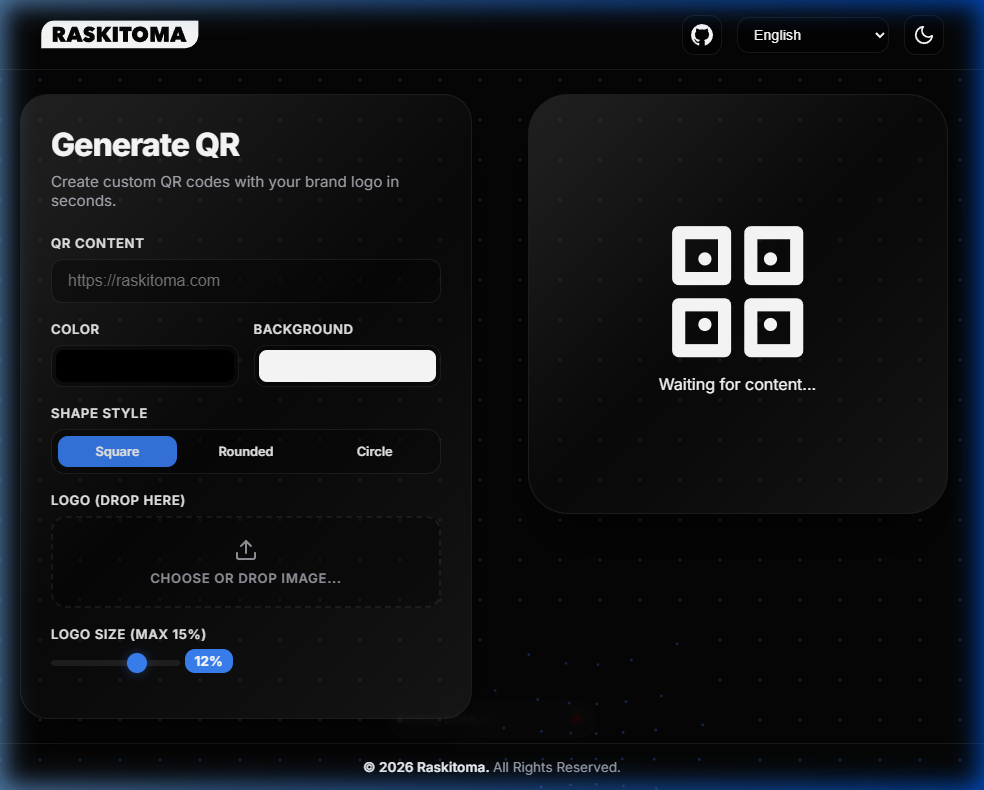

# Simple QRCode generator

> This is a mod from [DietPawel/pwscapp: Simple QR code generator](https://github.com/DietPawel/pwscapp)

I just added some beautification to it, also allowing to run on ARM (I'm running it in a raspberry pi). Separated most things to proper locations and to compile with any possible coding and security standards.

[](https://sonarqube.raskitoma.com/dashboard?id=Raskitoma-QRCode)



## Running locally

```bash
#git clone ...
#cd <clone dir>
virtualenv venv
source venv/bin/activate
pip install -r requirements.txt
cd app
uwsgi --ini uwsgi.ini
```

By default it runs on 0.0.0.0:3000

## Run in a docker contianer

Edit docker-compose.yml file as needed (port info, etc), next, do the following:

```bash
docker-compose build
```

After it ends the building process, run the container:

```bash
docker-compose up -d
```

Browse to `http://<qrcode host>:<port>`. The default should be 3000, but for the current docker-compose.yml file it is 8060.

> This is a mod from [DietPawel/pwscapp: Simple QR code generator](https://github.com/DietPawel/pwscapp)
