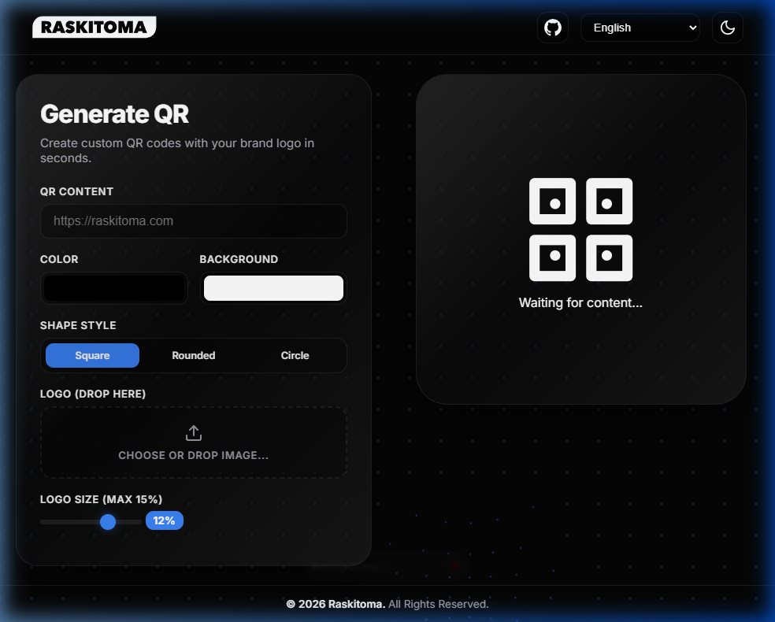

# QR Code Generator

A professional, high-performance web application to generate high-quality QR codes with custom styling and branding.



## ✨ Features

- **Modern Interface**: A clean, premium design with support for both Dark and Light themes.
- **Advanced QR Customization**: Generate QR codes with unique module shapes (Rounded, Dots, Circle) and custom eye (finder) patterns.
- **Seamless Branding**: Easily embed logos into the center of your QR codes. Supported formats include PNG, JPEG, WebP, GIF, and SVG.
- **Color Control**: Full customization of QR foreground and background colors.
- **Scan-Safe Scaling**: Automatic logo scaling limits (max 15%) to ensure your QR codes remain scannable on all devices.
- **Multilingual Support**: Fully localized in English and Spanish (Latin American).
- **Responsive Layout**: Optimized for both desktop and mobile devices.

## 🐳 Docker Hub

The official image is available for multiple architectures:
```bash
docker pull raskitoma/qrcode:latest
```

## 🚀 Quick Start (Docker)

The application is fully containerized and easy to deploy.

1. **Clone the repository**:
   ```bash
   git clone https://github.com/raskitoma/qrcode.git
   cd qrcode
   ```

2. **Deploy with Script**:
   We provide a convenient deployment script that pulls the official image (or builds locally if needed), initializes your environment (`.env`), and starts the service:
   ```bash
   chmod +x deploy.sh
   ./deploy.sh
   ```

3. **Alternative Manual Deploy**:
   If you prefer to configure settings manually before starting:
   ```bash
   cp .env.sample .env
   # Edit .env to your liking
   docker compose up -d --build
   ```

The application will be available at `http://localhost:8060` by default.

## 💻 Multi-Arch Support

This project is built using a Debian-based slim image to ensure maximum reliability and performance across different processor architectures. It is fully compatible with:
- **x86_64 / AMD64** (Standard Desktop/Server)
- **ARM64 / AArch64** (AWS Graviton, Apple Silicon M1/M2/M3, Raspberry Pi 4+)

## ⚙️ Configuration

Customize your deployment in the `.env` file:

| Variable | Description | Default |
|----------|-------------|---------|
| `HOST_PORT` | Port on the host machine | `8060` |
| `PIXEL_WIDTH` | Export resolution (higher = sharper) | `20` |
| `FG_COLOR` | Default QR color | `#000000` |
| `BG_COLOR` | Default background color | `#ffffff` |

## 🛠️ Tech Stack

- **Backend**: Python 3.12, Flask, Pillow, qrcode
- **Frontend**: Vanilla JS (ES6+), Modern CSS3 (Grid/Flex)
- **Container**: Docker + Docker Compose

---
Developed by [Raskitoma](https://raskitoma.com)
